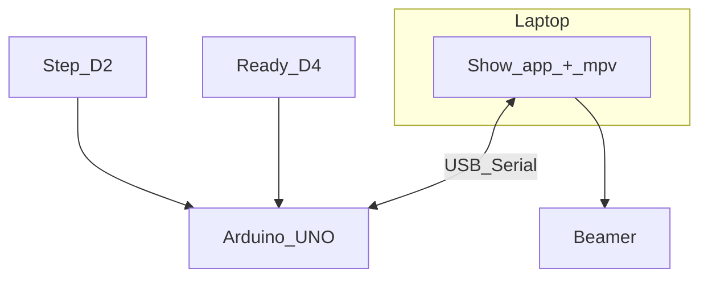

# Curtain rail + video sync — plan

## Current status

- **Arduino** firmware is **uploaded** and **running** (`arduino/jip_rail_controller/`). **Laptop** show app is **installed** and **running** (`laptop/jip_show.py`, **mpv**, ordered **`videos/*.mp4`**). USB serial at **115200** carries **`NEXT <n>`** and **`HIDE`**.
- **Open issue:** **sequence and button combinations** do not yet match the **intended** operator flow. Examples of what debouncing, **re-arm**, and edge timing must respect: **step** should only start transport when safe; **`HIDE`** should fire when **ready** clears after an in-position stop (not spuriously); **`NEXT`** must advance the playlist **once** per card; combined **D2/D4** use on the bench tact must not **double-advance** or **skip** **`HIDE`**. Firmware and/or operator procedure need a **focused pass** against the [Show cycle](#show-cycle) below.

Parts, tutorials, and long hardware notes: **[reference/links.md](reference/links.md)**. Pin map and bench wiring: **[arduino/jip_rail_controller/README.md](arduino/jip_rail_controller/README.md)**.

## What you are building

Motorized curtain rail; **step** starts transport (motor until **ready**). **Ready** is the show clock: when the card is **in position**, the Arduino **stops the motor** and sends **`NEXT`**; when **ready clears**, it sends **`HIDE`**. Laptop + beamer loop **one mp4 per card** in fixed order. **No limit switches** — **ready** is the sole in-position signal. Final rail: **XY‑160D** + **12 V** motor; **bench** may use **relay + small motor** (same sketch pins: **D2** step, **D3** relay, **D4** ready).

## Show cycle

| Control | Role |
| --- | --- |
| **Step (D2)** | Starts transport — motor **on** until **ready** stops it. Does **not** send show lines (unless you add debug). |
| **Ready active** | Motor **off**; **`NEXT <n>`** → laptop loads and **loops** next **mp4**. |
| **Ready inactive** (after a valid stop) | **`HIDE`** → stop/black projection; **playlist index unchanged**. |

**Playlist rule:** advance **only** on **`NEXT`**. **`HIDE`** never increments the index.

**Bench tact on D4:** **press** simulates in-position (**NEXT**); **release** simulates clear (**HIDE**). A **held** tact never releases — behavior differs from a real sensor that clears when the card moves; use that to debug **ordering** before swapping hardware.

## Serial contract (Arduino → laptop)

The laptop parses line-at-a-time at **115200**:

| Line | When | Laptop |
| --- | --- | --- |
| **`HIDE`** | **Ready** inactive after an armed in-position stop | IPC stop/black; **do not** change playlist index |
| **`NEXT <n>`** | **Ready** active edge when motor stops / seated | IPC load and loop **next** clip (or validate **`<n>`**) |

Ignore other lines. **CR** / **LF** endings.

## Arduino firmware (summary)

- Debounced **D2** / **D4**; **D3** relay ( **`RELAY_ACTIVE_LOW`** for opto modules).
- **`onStopPressed`**: motor off, **`NEXT`**, increment clip counter, arm **`HIDE`**.
- **`onReadyReleased`**: **`HIDE`** only if armed (suppresses noise at boot).

Source of truth: **`jip_rail_controller.ino`**.

## Laptop app (summary)

**Python 3**, **pyserial**, **mpv** with **`--input-ipc-server`** — one process; **`NEXT`** / **`HIDE`** drive **`loadfile`** / stop. **`--fs-screen`** targets the projector. Details: **[laptop/README.md](laptop/README.md)**.

## Environment

| Topic | Notes |
| --- | --- |
| **Show computer** | MacBook Air (M2) + **HDMI** beamer; **extended** desktop; set **`fs-screen`** to projector index |
| **Serial device** | e.g. **`/dev/cu.usbmodem…`** — pass **`--port`** if auto-detect is wrong |

## Later: real ready sensor on D4

Keep **`HIDE`** / **`NEXT …`** lines fixed. Change only wiring and firmware polarity/debounce if the production sensor’s active level differs from bench **HIGH** = ready.

## Remaining work (priority)

1. **Sequence / buttons** — Reproduce unwanted cases (double **`NEXT`**, missing **`HIDE`**, wrong order on **step** + **D4**). Adjust **re-arm**, edge gating (e.g. only **`HIDE`** after **`NEXT`**), or require **step** before accepting another **ready** cycle; document the **operator** sequence once stable.
2. **Rehearsal** — Full loop: **step** → move → **`HIDE`** when **ready** clears → dark while moving → **`NEXT`** at in-position → loop; repeat through playlist.
3. **Rail** — Swap bench relay rig for **XY‑160D** + **12 V** when mechanics are fixed; **D4** sensor replace tact when ready.

## Folder layout

| Path | Role |
| --- | --- |
| **`arduino/jip_rail_controller/`** | Firmware + pin README |
| **`laptop/`** | **`jip_show.py`**, venv, **`videos/`** |
| **`reference/links.md`** | Parts and links |
