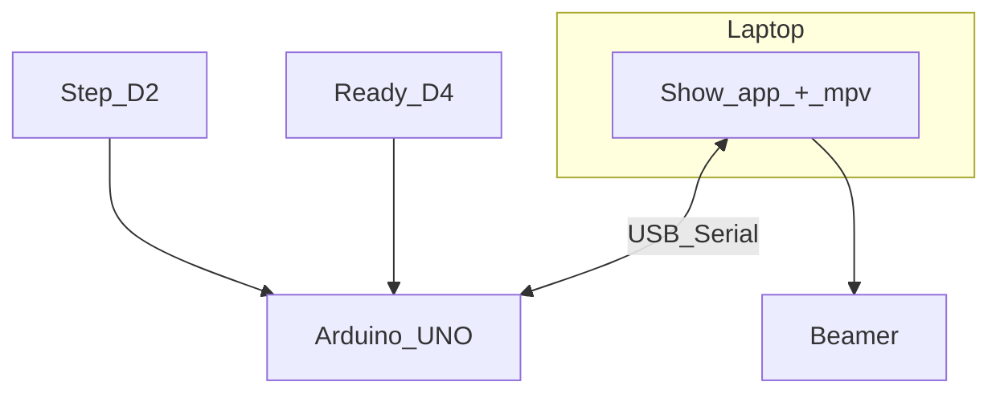

# Curtain rail + video sync — plan

## Current status

**Arduino** and **laptop** (`jip_show.py`) are the live stack: **115200** serial, **`NEXT <n>`** / **`HIDE`**. Behaviour matches [Show choreography](#show-choreography) below (upload the current `jip_rail_controller.ino`).

Hardware notes: **[reference/links.md](reference/links.md)**. Pins and bench wiring: **[arduino/jip_rail_controller/README.md](arduino/jip_rail_controller/README.md)**.

## What you are building

Motorized curtain rail: **STEP** advances the **mechanical** state (motor on for the next move) and **stops video** when a clip is already playing. **READY** only participates **while the motor runs** — it does **not** stop video. Laptop + beamer play **one ordered mp4 per card**, looping until the next **STEP**. **No limit switches** for v1; **READY** is the in-position signal for **when to stop the motor** and cue **which** clip (via **`NEXT`**). Final rail: **XY‑160D** + **12 V** motor; bench may use **relay + small motor** (**D2** STEP, **D3** relay, **D4** READY).

## Show choreography

**Boot:** Motor **off**. **READY** may be open or closed. Laptop shows **no** video (until the first **`NEXT`**).

**STEP press (D2):**

1. If a clip is **playing** (`NEXT` already happened for this card): send **`HIDE`** immediately (laptop stops video; playlist index **unchanged**).
2. Motor **on**.
3. Wait for **READY open** (logic **LOW** with kit pull-down wiring = “open”). If **already open**, skip this wait.
4. Wait for **READY closed** (**HIGH** = in position).
5. Motor **off**; send exactly one **`NEXT <n>`** → laptop loads **one** file and **loops** it (`<n>` is informational; **laptop** advances its playlist on each **`NEXT`**).

**While a clip loops:** **READY** does **not** send **`HIDE`** or **`NEXT`**. Only **STEP** starts the next move and blanks projection.

**STEP ignored** while the motor is already moving (between STEP and the **READY** close that fires **`NEXT`**).

| Signal | Role |
| --- | --- |
| **`HIDE`** | **STEP** while video is playing — immediate blackout; **not** tied to **READY** release. |
| **`NEXT <n>`** | After motor run, when **READY** closes — motor stops; **one** clip loops. |

**Playlist rule:** laptop increments only on **`NEXT`**. **`HIDE`** does not advance the index.

**Bench tact on D4:** **OPEN** then **CLOSED** simulates transit then “in position.” For testing: after **STEP**, release **D4** (open) then press **D4** (close) to complete the cycle.

## Serial contract (Arduino → laptop)

Parse line-at-a-time at **115200**:

| Line | When | Laptop |
| --- | --- | --- |
| **`HIDE`** | **STEP** pressed while a clip is considered active (firmware: after a completed **`NEXT`** cycle until the next **STEP**) | IPC **stop** / idle; **do not** change playlist index |
| **`NEXT <n>`** | **READY** **closed** after motor start and **OPEN** phase as above | IPC **loadfile** + loop **next** playlist entry |

Ignore other lines. **CR** / **LF** endings.

## Arduino firmware (summary)

Debounced **D2** / **D4**; **D3** relay (**`RELAY_ACTIVE_LOW`** for opto modules). State: **`MOVE_WAIT_OPEN` / `MOVE_WAIT_CLOSE`**, **`showingVideo`**. Source of truth: **`jip_rail_controller.ino`**.

## Laptop app (summary)

**Python 3**, **pyserial**, **mpv** JSON IPC; **`NEXT`** → `loadfile` next path; **`HIDE`** → `stop`. **[laptop/README.md](laptop/README.md)**.

## Environment

| Topic | Notes |
| --- | --- |
| **Show computer** | MacBook Air (M2) + **HDMI** beamer; **extended** desktop; **`--fs-screen`** = projector index |
| **Serial device** | e.g. **`/dev/cu.usbmodem…`** or **`--port`** |

## Later: real READY sensor on D4

Keep **`HIDE`** / **`NEXT …`** semantics. Adjust wiring/firmware only if **closed**/**open** polarity differs from bench **HIGH** = closed (in position).

## Remaining work (optional / production)

1. **Rehearsal** on hardware: **STEP** → transit → **READY** close → loop; **STEP** again → **`HIDE`** + move → next clip.
2. **Rail** — **XY‑160D** + **12 V**; replace bench relay.
3. **Polish** — logging, venue runbook, optional use of **`<n>`** on laptop to validate against manifest.

## Folder layout

| Path | Role |
| --- | --- |
| **`arduino/jip_rail_controller/`** | Firmware + pin README |
| **`laptop/`** | **`jip_show.py`**, **`videos/`** |
| **`reference/links.md`** | Parts and links |
