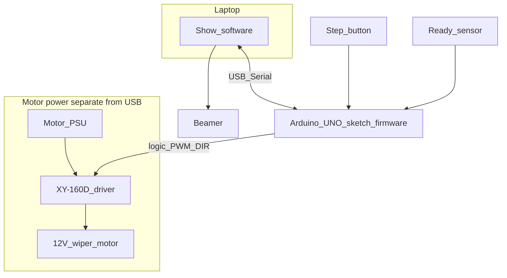
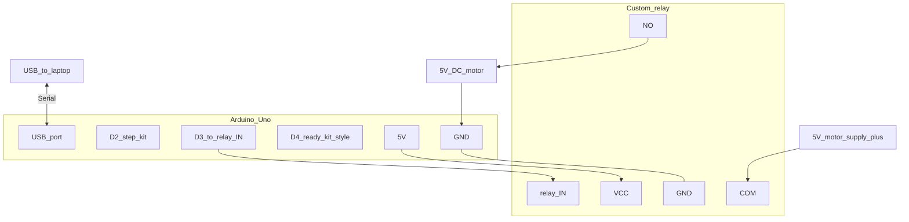
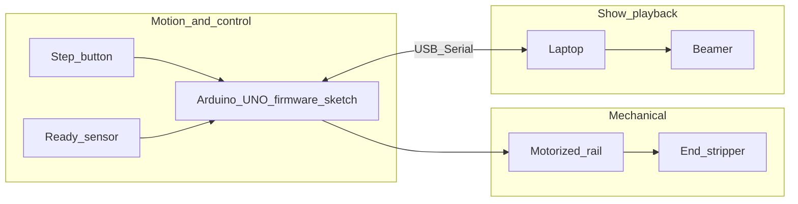
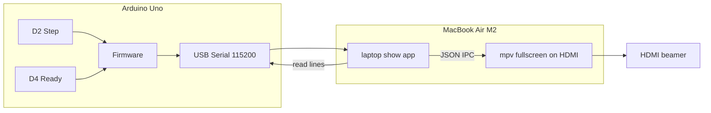
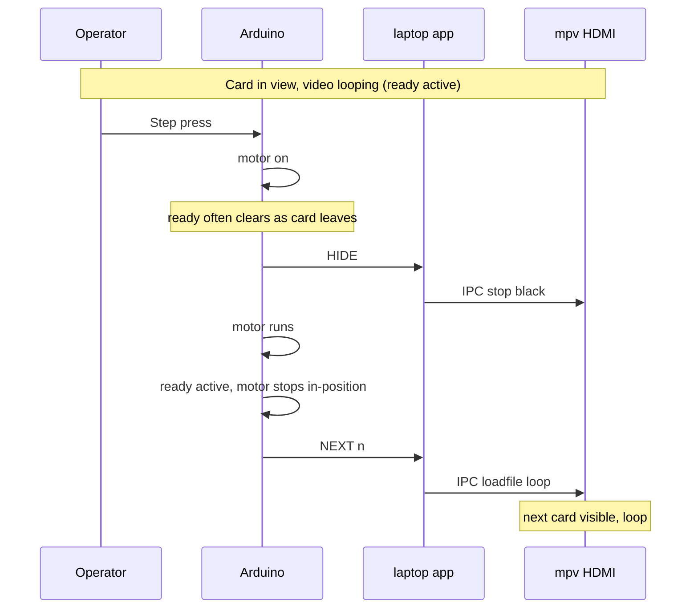

# Installation — global design

## Project phasing

| Phase | Focus | Outcome |
| --- | --- | --- |
| **1 — Now** | **Arduino only** | Show-cycle logic on the bench: **step** starts motor (relay test rig, later **XY‑160D**), **ready** stops it; **re-arm** works; **`Serial.print`** proves events ( **Serial Monitor** , no show software yet). |
| **2 — After** | **Laptop + video** | **`laptop/`** on **MacBook Air (M2)** + **HDMI**: **step** starts the **move**; **ready** **starts** show (**`NEXT`**, loop **mp4**) and **stops** show (**`HIDE`** when ready clears); **v1** uses **mpv JSON IPC** for precise timing. |

The rest of this document describes the **full installation**. **Phase 1** is **verified** on the bench. **Phase 2** is specified below in [Phase 2: Laptop, beamer, and serial sync](#phase-2-laptop-beamer-and-serial-sync). Swapping the **D4** tact for a real **ready sensor** later is **Arduino-only**; keep the **`HIDE`** / **`NEXT`** serial contract so **laptop code** stays valid — see [Later phase: bench input to real ready sensor](#later-phase-bench-input-to-real-ready-sensor).

## What you are building (one paragraph)

A **motorized curtain rail** moves cards along a line; at the far end a **stripper** removes cards from the hangers. A **laptop** drives a **beamer** with looping clips. **Control narrative (agreed):** the **step** control **starts the transport sequence** (motor runs until **ready**). The **ready sensor** is the **show clock**: when the card **is in position**, the Arduino **stops the motor** and sends **`NEXT`** so the laptop **starts** that card’s looping **mp4**; when **ready clears** (card leaves the in-position zone), the Arduino sends **`HIDE`** so projection **stops** before or as the rail moves again. The operator presses **step** for the next move; the motor runs until **ready** trips **again**. **No limit switches**—the ready input is the sole “stop here / in position” signal (type and mounting TBD). **Phase 2** extends **USB serial** with **`HIDE`** (ready **falling**); **Phase 1** is **`NEXT`**-only until that firmware lands.

**Code basis:** same class of setup as in [Rachel De Barros: DC motor + motor driver + Arduino](https://racheldebarros.com/arduino-projects/turn-on-dc-motor-with-pir-motion-sensor-and-arduino/)—bidirectional DC and speed control via **XY‑160D**; triggers are **step + ready** instead of PIR-only, plus **laptop** messages.

## Components you have (ordered kit) + documentation

The Amazon line in [reference/links.md](reference/links.md) matches **ELEGOO EL-KIT-001** (“UNO R3 Project Most Complete Starter Kit”, ASIN **B01IHCCKKK**): UNO R3, breadboard, USB cable, many lesson modules, and a printed/CD tutorial. When your box arrives, confirm against the packing list (kit revisions **V1.0 / V2.0** can differ slightly).

The table below lists **parts that matter for this installation**, whether they are **in that kit**, and **where the docs live** (same URLs as `reference/links.md`).

| Component or module | In EL-KIT-001? | Role in this installation | Documentation (see [reference/links.md](reference/links.md)) |
| --- | --- | --- | --- |
| ELEGOO UNO R3 + USB cable | Yes | Microcontroller; **USB serial** to laptop; GPIO for **XY‑160D**, **step button**, **ready sensor** | [ELEGOO kit tutorial & downloads](https://www.elegoo.com/blogs/arduino-projects/elegoo-uno-r3-project-the-most-complete-starter-kit-tutorial), [kit product page](https://www.elegoo.com/products/elegoo-uno-most-complete-starter-kit) |
| Breadboard, jumper wires, Dupont wires | Yes | Prototype connections | Same as above |
| Small tactile buttons (×5 in typical listing) | Yes | **Step button:** starts motor for the next transport segment (debounced) | Kit PDF / lessons |
| IC **L293D** (DIP in kit) | Yes | Spare / **low‑current** experiments only; **not** the main path once **XY‑160D** is wired | Kit PDF; [motor driver concepts](https://racheldebarros.com/arduino-projects/turn-on-dc-motor-with-pir-motion-sensor-and-arduino/) |
| **ULN2003** board + 5‑wire stepper | Yes | Lesson hardware; **not** the primary choice for the curtain **DC** rail unless you change the mechanical design | Kit tutorial |
| **SG90** servo (+ 3 V micro servo in some lists) | Yes | Optional: active **stripper / release** assist if not fully passive | Kit tutorial |
| **5 V relay module** | Yes | Optional: **enable / emergency cut** of motor supply path (design-dependent; respect ratings) | Kit tutorial |
| **HC-SR501** PIR | Yes | **Not** the planned **ready** signal (show order is step-driven); optional unrelated experiments | [Rachel PIR + motor article](https://racheldebarros.com/arduino-projects/turn-on-dc-motor-with-pir-motion-sensor-and-arduino/) |
| Power supply module, 9 V adapter, battery snap | Yes | Kit **9 V** items are for **lessons**, not for the **12 V wiper**; the rail needs a dedicated **12 V** motor supply (see hardware section) | Kit tutorial |
| LCD1602, sensors (ultrasonic, DHT11, RFID, …), LEDs, passives, etc. | Yes | Not required for v1 rail + video; useful for **debug** or future ideas | Kit tutorial |
| **Curtain rail mechanics + 12 V car wiper motor** | No (build / salvage) | **Wiper motor** drives the rail; **coupling** (gear, pulley, friction wheel) is mechanical design. **12 V** nominal on the motor power bus to the **XY‑160D**. Expect **multi‑amp** loads under stall or drag—match **PSU** and driver ratings | [reference/links.md](reference/links.md) (rail actuator section); [Rachel tutorial — wiper-class motor + 12 V supply](https://racheldebarros.com/arduino-projects/turn-on-dc-motor-with-pir-motion-sensor-and-arduino/) — add your **exact motor / rail** URL to `links.md` when fixed |
| **XY‑160D** motor driver module | **Yes (ordered)** | **Primary** driver for the curtain **DC** motor: direction via **IN1/IN2**, speed via **ENA** (PWM on a `~` pin); motor supply on module’s **high‑current** screw terminals | [Order link in reference/links.md](https://amzn.to/46rwGHT); wiring pattern aligned with [Rachel article XY‑160D section](https://racheldebarros.com/arduino-projects/turn-on-dc-motor-with-pir-motion-sensor-and-arduino/) |
| **Ready sensor** (one, type TBD) | TBD | **Active:** **stop motor**, **`NEXT`** (start / advance looping clip). **Inactive** after that stop: **`HIDE`** (blank beamer). Ideally the sensor **clears as the card leaves** the view so **`HIDE`** tracks motion; firmware **re-arm** avoids bogus edges. **Replaces limit switches** for this design | Add part link to [reference/links.md](reference/links.md) when chosen |
| **Limit / home switches** | No | **Explicitly not used** in this design | — |
| **Laptop + beamer** | No | **`NEXT`** starts **next** looped clip when card is seated; **`HIDE`** when **ready clears**; **step** only starts motor | — |

**Parts inventory source for the long listing:** [Newegg EL-KIT-001 component list](https://www.newegg.com/elegoo-el-kit-001-accessories/p/293-001C-00001) — use to tick off the box contents; treat as secondary to what is physically in your shipment.

## Hardware connection design (global)

This is the **wiring story** (not yet a pin map): separate **logic** from **motor power**, and keep **one** USB path to the laptop for show control. **Stopping** uses only the **ready** sensor, not limit switches. The UNO runs a **sketch** (firmware); **what** it does is in [Arduino software design](#arduino-software-design) below.

- **Laptop ↔ UNO:** one **USB** cable — 5 V powers the board; **Serial**: **`NEXT`** when **ready** stops the motor; **`HIDE`** when **ready clears** after an in-position stop (Phase 2).
- **UNO ↔ XY‑160D:** **logic only** — typically **5V**, **GND**, **ENA** (PWM speed), **IN1** / **IN2** (direction) to the column you use for **motor 1**, matching your board silkscreen and the [Rachel XY‑160D wiring notes](https://racheldebarros.com/arduino-projects/turn-on-dc-motor-with-pir-motion-sensor-and-arduino/); **common ground** between UNO and driver logic **per module datasheet**.
- **XY‑160D ↔ wiper motor:** motor wires to the driver’s **motor outputs** (polarity only swaps direction). **12 V motor bus** from a **PSU sized for worst-case current** (wiper motors can draw **several amperes** under load or near stall; the reference build discusses **12 V / multi‑amp** supply). **Never** power the wiper from the Arduino **5 V** pin.
- **Step button:** **digital input** (debounced). **Press:** permit **motor run** until **ready** fires.
- **Ready sensor:** **digital** (or conditioned) **input**. **Active:** **stop motor**, **`NEXT`** → laptop starts **next** looping clip. **Inactive** (after seated interval): **`HIDE`** → laptop blanks. After **step**, motor runs until **ready** is active **again**; handle **stuck level** with **re-arm** in firmware (detail pass).
- **Beamer:** **HDMI** (or whatever the laptop outputs); no electrical tie to the Arduino.

**Bench testing:** the block diagram above stays conceptually the same, but the **driver + high‑voltage motor** pair is temporarily **relay + 5 V motor**—see [Arduino wiring diagram (simplified)](#arduino-wiring-diagram-simplified).

**Gap to close after unboxing:** **Motor type is set** (**12 V wiper**). Select **12 V** PSU **A** rating, **fuse** / protection, **XY‑160D** wiring. **Additionally:** on the test bench, validate **step / ready / serial** with the **relay + 5 V** rig first; then pick **ready** hardware for the real rail, tune timing, and freeze **serial** phrasing so the laptop never skips or double-advances clips.

## Arduino wiring diagram (simplified)

**Current bench test:** Follow the **relay + 5 V motor** layout from this walkthrough: [YouTube — DFRobot Arduino R3, proto shield, relay, motor](https://www.youtube.com/watch?v=GxvDaQeCQKw) (also listed in [reference/links.md](reference/links.md)). Same **idea** (MCU → relay → motor supply), but **this project uses a different relay module**—map **IN / VCC / GND** and **COM / NO / NC** (and active‑HIGH vs active‑LOW) to **your** part, not necessarily the one on screen.

**Hardware on bench:** **DFRobot Experiment 13** layout from the kit + Arduino IDE sample [project_13.ino](https://github.com/DFRobot/Beginner-Kit-for-Arduino/blob/master/Sample%20Code/project_13/project_13.ino): **D2** = step button (kit pull‑down, **HIGH** = pressed), **D3** = relay (our **custom** relay module still uses **D3** for the logic input). **D4** = **ready** (wire like the kit button — **HIGH** when active). **USB** to laptop. **One direction only**—relay **on/off**.

**Final install (unchanged in the rest of this plan):** **XY‑160D** + **12 V wiper** for bidirectional / PWM rail drive—swap the motor power stage when you move off the test rig.

**Switch logic (sketch):** Default **`DFRobot_EXP13_INPUTS` 1** in `jip_rail_controller.ino`: **D2** / **D4** use **`INPUT`** with the kit’s **pull‑down** wiring (**HIGH** = pressed). For tactiles on a breadboard with **`INPUT_PULLUP`**, set **`DFRobot_EXP13_INPUTS` 0**.

**Relay logic:** **D3** drives your **custom** module; adjust **`RELAY_ACTIVE_LOW`** (`0` = kit‑style **HIGH** energizes many discrete relays; `1` = common opto modules).

**Motor current:** Prefer a **separate 5 V supply** (second USB adapter, bench supply) for the **motor / relay contact** side if the motor is more than a **tiny** load; tie **GND** of that supply to **Arduino GND**. Do **not** try to run a stiff motor entirely from the Uno’s **5 V** pin.

**Example pins (test rig):** **DFRobot project 13** + **D4** for ready — see [reference/links.md](reference/links.md).

| Arduino (DFRobot exp 13 + JIP) | To |
| --- | --- |
| **D2** | Step (**kit** button, **HIGH** = pressed) |
| **D3** | **Custom** relay logic input (was kit relay pin in lesson) |
| **D4** | Ready (same **pull‑down** style as kit button) |
| **5 V / GND** | Per **your** relay module |
| **USB** | Laptop |

| Relay module (contact side) | To |
| --- | --- |
| **COM** | **5 V motor +** (positive rail for the motor circuit) |
| **NO** (normally open) | **Motor +** |
| **Motor −** | **GND** (common with Arduino) |

When the relay **pulls in**, **COM** connects to **NO** and the motor sees **~5 V**. **NC** unused for this diagram.

## The three subsystems

- **Mechanical:** rail + wiper drive, hanger geometry, stripper; **ready** placed so **active** = stop motor and cue the matching **show** moment.
- **Motion + control:** **Arduino UNO** (board + **sketch** — see [Arduino software design](#arduino-software-design)), **XY‑160D**, **step** and **ready** inputs, drives the rail.
- **Show playback:** laptop + beamer; **step** only **starts** motion; **`NEXT`** when **ready** stops the motor (card seated) **starts** the **next** looping **mp4**; **`HIDE`** when **ready clears** **stops** projection for precise **in-position** timing. Laptop software: [Laptop software design](#laptop-software-design).

## Show cycle (ready sensor, no limit switches)

- **Step:** **starts** the sequence — motor **on** until **ready** stops it (**no** laptop line on step unless you add optional debug).
- **Ready active** (in-position): motor **stops**; **`NEXT`** → laptop **starts** the **next** ordered **mp4**, **looping**.
- **Ready inactive** after that (sensor clears, card leaves zone): **`HIDE`** → laptop **stops** projection **immediately** (low-latency **mpv** IPC in **v1**).
- **Re-arm / bench:** production sensor should **clear** when the hanger moves; on a **held tact** for **D4**, **release** the button to simulate **`HIDE`**, or firmware treats a second edge under a test flag — see implementation notes in Phase 2.

**Step index / “which clip”:** advance playlist **only** on **`NEXT`**. **`HIDE`** tears down playback **only**; it does **not** increment the index.

## Arduino software design

Firmware runs **on the UNO** as a single sketch (**Phase 1** → `arduino/`). Intended structure:

- Read **step** and **ready** (with **debouncing** / stable **re-arm** so a stuck **ready** does not break the cycle).
- **State machine** matching the show cycle: idle (motor off) vs running until **ready** stops the move.
- **Motor output:** on the **test rig**, **D3** drives the **custom** relay like **DFRobot experiment 13** (**on/off** only; **`RELAY_ACTIVE_LOW`**). For **final install**, use **XY‑160D**: **PWM** on **ENA** and direction on **IN1/IN2**.
- **USB Serial (Phase 2):** when **ready** stops the motor, print **`NEXT <n>`**; when **ready** becomes **inactive** after a completed in-position stop (debounced **falling** edge), print **`HIDE`**. **Step** does **not** emit show lines. See [Serial contract](#serial-contract-arduino--laptop).

## Laptop software design (Phase 2 — summary)

The full breakdown is in **Phase 2** below. In one line: **Python 3** under **`laptop/`** reads **`NEXT`** / **`HIDE`**; **v1** runs **mpv** with **`--input-ipc-server`** and sends **JSON** commands (`loadfile`, stop/black) for **precise** timing; **`videos/`** (or manifest) is the ordered **mp4** list.

## Phase 2: Laptop, beamer, and serial sync

This section is the **implementation plan** for show software. The Arduino stays **USB-connected** to the **same computer** that drives the **beamer**.

### Assumptions (Phase 2 staging)

| Topic | Choice |
| --- | --- |
| **Show computer** | **MacBook Air (Apple Silicon M2)** — runs the **`laptop/`** app and owns the **USB** link to the Arduino. |
| **Projection path** | **Beamer** plugs into the laptop’s **HDMI** port (directly or via a **USB‑C hub / DisplayPort alt‑mode** adapter, depending on the exact Air model and your dongle). |
| **Displays** | **Extended desktop** recommended: **built-in** = operator / debug; **HDMI** = audience **only** fullscreen video (configure once in **System Settings → Displays**). |

### Starting requirements (product behavior)

1. **Step** (D2) **starts mechanical transport** for the **next** card: motor runs until **ready** (D4 / future sensor) stops it. The *show* interpretation: this is the **beginning of the cycle** that ends with that card **settled in the viewing position**.
2. **Projection timing** — **On** as soon as the card **is in position** (**`NEXT`** when **ready** stops the motor). **Off** when **ready clears** (**`HIDE`**) so the beamer is **dark while the rail moves**; tie-off is **sensor-driven**, not **step-driven**.
3. **Media** — **One `.mp4` per card**; while the card is **visible** (ready **held** in the “in-position” sense), that file **plays and loops** without gaps.
4. **Order** — Cards and clips follow a **single fixed order** (playlist index advances **only** on **`NEXT`**).

**Choreography vs current bench firmware:** Phase 1 prints **`NEXT`** only on **D4 press**. Phase 2 **adds `HIDE` on ready release** (falling edge) after a stop. A **held tact** never releases — **release D4** to test **`HIDE`**, or use a sensor that **clears** when the card moves.

### Platform choice (laptop software)

**Question:** what stack makes it practical to **target HDMI output** and keep development fast?

**Recommendation for v1: Python 3 + pyserial + mpv (Homebrew).**

| Criterion | Why this fits |
| --- | --- |
| **Fullscreen on the beamer only** | **mpv** supports **`--fs-screen=<n>`** (screen index). After **Display Arrangement** labels the projector, pin **`n`** in config (often **`1`** when **`0`** is the built-in Liquid Retina). No need for low-level **Quartz** code in v1. |
| **Serial** | **pyserial** is stable; device is typically **`/dev/cu.usbmodem…`** on macOS. |
| **mp4 loop** | **`mpv --loop-file=inf`** matches “loop while card visible.” |
| **Precise start/stop (v1, required)** | **mpv JSON IPC** (`--input-ipc-server` + Unix socket): **`loadfile`** / **`stop`** (or black frame) with **no** per-event process **spawn** — low latency for **`NEXT`** / **`HIDE`**. |
| **Maintainability** | Small script; **`brew install mpv`** is one step. |

**Alternatives (when to reconsider):** **Swift + AppKit** or **SwiftUI** if you need a polished installer, menu-bar control, and native display APIs without shelling out to **mpv**; **Electron + Node** if the team strongly prefers JavaScript — heavier runtime. For this installation, **Python + mpv** is the best **time-to-reliable-show** tradeoff on **macOS**.

### High-level design (Phase 2)

**Purpose:** Three cooperating pieces — **Arduino** (truth for motion), **serial** (discrete events), **player** (fullscreen on HDMI).

**Event timeline (one card cycle):**

**State on the Mac (conceptual):**

- **Idle dark** — No file playing on HDMI (black **mpv** window quit, or **`--idle`** with no video shown); **safe** while the rail may move.
- **Showing *i*** — Playlist entry *i* is loaded via **IPC**; **mpv** loops that **mp4** until **`HIDE`**.

**Components:**

| Piece | Responsibility |
| --- | --- |
| **Playlist builder** | Deterministic ordered list of **`.mp4`** paths (sorted filenames or manifest file). Length **≥** number of cards in the show. |
| **Serial line parser** | **115200** line-at-a-time; recognize **`HIDE`** and **`NEXT …`** only; ignore other lines. |
| **Player bridge (v1)** | Launch **mpv once** with **`--fullscreen`**, **`--fs-screen=`**, **`--loop-file=inf`**, **`--input-ipc-server=<socket>`**. On **`NEXT`**, **IPC** `loadfile` **next** path; on **`HIDE`**, **IPC** stop / unload / black — **no** subprocess restart on each event. |

**Firmware note:** Track **ready** edges: **rising** (stop motor) → **`NEXT`**, **falling** (after a valid stop) → **`HIDE`**. Suppress spurious **`HIDE`** at boot and ensure **re-arm** only after **step** / motor run if needed. Phase 1 sketch has **`NEXT`** only — add **`HIDE`** and edge logic for Phase 2.

### Objectives

1. **Listen** at **115200** on the Arduino’s USB serial device (**`/dev/cu.usbmodem*`** on macOS).
2. **v1:** one long-lived **mpv** + **JSON IPC** for all **`NEXT`** / **`HIDE`** handling (precise timing — not optional “hardening”).
3. On **`NEXT`**, **IPC**-load the **next** playlist entry **fullscreen** on the HDMI screen, **`mp4` loop** until **`HIDE`**.
4. On **`HIDE`**, **IPC**-stop / black **immediately** when **ready** clears (playlist index unchanged).
5. Sensor swap on **D4** does not change **`HIDE`** / **`NEXT`** semantics.

### Serial contract (Arduino → laptop)

The laptop parses **two** line types (and ignores the rest):

| Line | When emitted | Laptop action |
| --- | --- | --- |
| **`HIDE`** | **Ready** goes **inactive** after an in-position stop (debounced **falling** edge) | **IPC**: stop / black; **do not** change playlist index. |
| **`NEXT <n>`** | **Ready** stops motor — same instant as today’s `onStopPressed` (**rising** / active edge) | **IPC**: load and **loop** the **next** clip in fixed order (or validate **`<n>`** against a manifest). |

**Playlist index rule (recommended):** maintain **`playlist_index`** on the laptop: each **`NEXT`** increments and loads that file; **`HIDE`** does not increment. **Alternatively**, use **`<n>`** from the Arduino as the clip id if you strictly couple sketch counter to folder order — then validate **`n`** is in range.

**Parsing:** Lines starting with **`HIDE`** (trim whitespace); lines starting with **`NEXT`** + whitespace + integer. **CR** and/or **LF** line endings.

### Later phase: bench input to real ready sensor

**Boundary:** **`laptop/`** and the **`HIDE`** / **`NEXT …`** lines stay fixed. Only **Arduino wiring + sketch** change when **D4** stops being a kit-style tactile and becomes the production sensor—**Phase 2** keeps listening for the same **two** tokens.

1. **Choose hardware** — One digital **“stop the move here”** signal (limit switch, proximity module, hall + magnet, etc.). Add part numbers and schematic notes to [reference/links.md](reference/links.md) when locked.
2. **Electrical interface** — Bring **safe logic levels** to the UNO: **5 V-tolerant behaviour on D4** per the ATmega328P datasheet; never exceed **Vcc** on the pin. Industrial **12 V / 24 V** outputs need **a divider, level shifter, comparator, or relay/opto**—not raw high voltage. Keep a **single GND** reference between sensor supply return and Arduino **GND** unless you use **galvanic isolation** (then only the Arduino-side of the isolator ties to UNO **GND**).
3. **Active level** — Match **logical active** to today’s meaning of **stop** (bench: **HIGH** on **D4** = ready). If the part asserts **LOW** when active, **invert in firmware** or choose **NC vs NO** wiring so **stop** still reads the same polarity you expect before touching show code.
4. **Firmware** — Emit **`NEXT <n>`** on **ready** **active** edge when stopping motor; emit **`HIDE`** on **ready** **inactive** edge **after** a valid stop (suppress boot noise). Tune **debounce**; **re-arm** — see [Show cycle (ready sensor, no limit switches)](#show-cycle-ready-sensor-no-limit-switches).
5. **Verify** — **Serial Monitor** at **115200**: cycle shows **`HIDE`** then **`NEXT`** (order depends on sensor: often **`HIDE`** when **ready clears** on **step**, then **`NEXT`** at next **in-position**); no spurious lines at idle.

**Pin:** Prefer keeping **D4** as **ready** so the sketch pin table stays stable; moving to another **digital** pin is a **one-line** change—USB text stays the source of truth for the laptop.

### `laptop/` project shape

| Piece | Role |
| --- | --- |
| **Playlist resolver** | Build an ordered list of video paths: e.g. sort filenames in `videos/*.mp4`, or read a small **manifest** (YAML/JSON/text) for explicit order. |
| **Serial reader** | Open **`/dev/cu.usbmodem*`** (or configured path) at **115200**, read line by line. Handle **USB reconnect** (optional v1: prompt user to restart app). |
| **Player backend** | **`mpv`** with **`--input-ipc-server`**; **v1** uses **JSON IPC** only (not one-shot **exec** per **NEXT**). |
| **Config** | Serial **device path** (or “auto-pick Arduino-like port”), **video directory**, optional fullscreen **display index**. |

### Implementation sequence (recommended)

1. **Arduino:** add **ready** **falling** → **`HIDE`** (with **re-arm** / no spurious boot); keep **`NEXT`** on stop; bench tact: **release D4** to test **`HIDE`**, or simulate with wiring.
2. **Create `laptop/`** in the repo with a minimal **README** pointing back here.
3. **Dev environment (Mac):** **`brew install mpv`**, Python **3.11+** + **`pyserial`** (venv / **pip**).
4. **Playlist stub:** ordered **`clip_000.mp4`**, … (or manifest).
5. **Serial stub:** print lines from **`/dev/cu.usbmodem*`**.
6. **mpv v1:** start **mpv once** with **`--input-ipc-server`** + **`--fs-screen=`** + **`--loop-file=inf`**; **Python** opens the IPC socket and sends **JSON** on each **`NEXT`** / **`HIDE`** (document exact commands in code).
7. **Beamer check:** **Displays** → **extended**; fix **`fs-screen`** index.
8. **Rehearsal:** **Step** → **`HIDE`** when **ready clears** → dark while moving → **`NEXT`** at **in-position** → loop; repeat.
9. **Later:** stderr logging, **LaunchAgent** / login item (venue Mac).

### Beamer and laptop OS (macOS)

- **Cable:** **HDMI** to beamer, or **USB‑C** dock / adapter with **HDMI** (common on **Air**).
- **Modes:** **Extended** display — fullscreen **mpv** on **projector** only; operator uses built-in for Terminal / debug.
- **Screen index:** Discover with **mpv** / trial **`--fs-screen=0`** vs **`1`** after arranging displays; fix in **config**.
- **Resolution / overscan:** set once in **Displays** or projector **overscan** menu so **mp4** is not cropped.

### Testing checklist (Phase 2)

- [ ] **Firmware:** **`HIDE`** only on **ready** **falling** (after arm); **`NEXT`** on **in-position** stop; no lines at idle.
- [ ] **IPC:** **mpv** stays running; **`NEXT`** / **`HIDE`** hit the same socket (no per-event **spawn**).
- [ ] Playlist advances **only** on **`NEXT`**.
- [ ] **`HIDE`** blanks **without** advancing index; clip **loops** until **`HIDE`**.
- [ ] Visually: **no** video while rail **moves** ( **`HIDE`** before / during move).
- [ ] Unplug/replug USB: document whether app must restart (acceptable for v1).

### What stays for a “detail pass” after Phase 2 v1

**venv + requirements.txt**, **notarized** bundle (if needed), **CI**, venue **runbook** — **IPC** / timing are **not** deferred; they are **v1**.

## Folder split (project shape)

- **`arduino/`** — Bench sketch + [README](arduino/jip_rail_controller/README.md); later **XY‑160D** + **ready sensor** swap. Same **USB** now shared with **Phase 2** show app.
- **`laptop/`** — **Phase 2 (in progress):** playlist, player, **serial listener** — see [Phase 2 section](#phase-2-laptop-beamer-and-serial-sync).

Shared contract (for Phase 2): **`HIDE`** when **ready clears** blanks HDMI; **`NEXT`** when **ready** stops the motor loads and loops the **next** ordered **mp4**; **step** starts motion only (no show line).

## Global answers to your three questions (no dive yet)

| Topic | Global idea |
|--------|----------------|
| **Video vs mechanics** | **Ready stop** → **`NEXT`** (next **mp4** loop). **Ready clear** → **`HIDE`**. **Step** → motor only. |
| **Button** | **Step** starts transport; **ready** edges **start/stop** projection. |
| **Playing videos** | **One mp4 per card**, fixed order; **loop** only while **ready** says **in-position** (until **`HIDE`**). |

## What we defer to a “detail pass”

**Phase 1:** **ready** hardware choice, **re-arm** / edge logic, final pin map, debounce constants, relay vs **XY‑160D** swap checklist, optional motor timeout / jam behavior. **Limit switches** remain **out of scope**.

**Phase 2:** see [Phase 2: Laptop, beamer, and serial sync](#phase-2-laptop-beamer-and-serial-sync) — **Python + pyserial + mpv JSON IPC** on **MacBook Air M2**; **`HIDE`** / **`NEXT`** from **ready** edges.

## Next step

**Phase 2:** Arduino — **`HIDE`** on **ready fall** (+ **re-arm**); **`laptop/`** — playlist, serial @ **115200**, **mpv** **IPC** for **`NEXT`** / **`HIDE`** on HDMI; rehearse on beamer.
