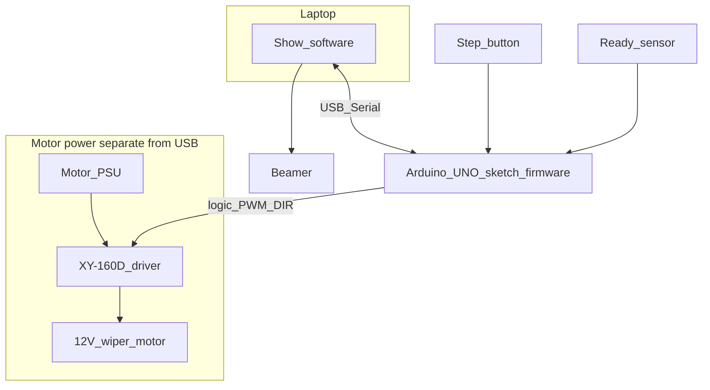
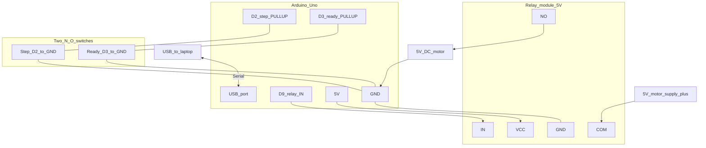
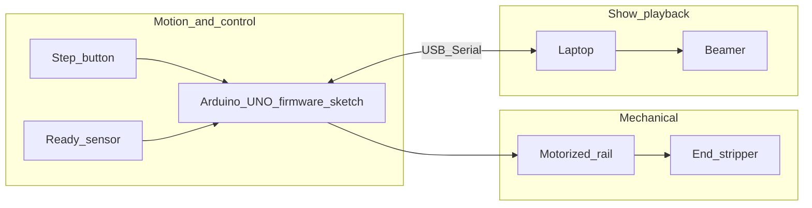

# Installation — global design

## Project phasing

| Phase | Focus | Outcome |
| --- | --- | --- |
| **1 — Now** | **Arduino only** | Show-cycle logic on the bench: **step** starts motor (relay test rig, later **XY‑160D**), **ready** stops it; **re-arm** works; **`Serial.print`** proves events ( **Serial Monitor** , no show software yet). |
| **2 — After** | **Laptop + video** | **`laptop/`** app: same **USB serial** cues → **next** looping clip on **beamer**; playlist + player tool. |

The rest of this document describes the **full installation**; implementation work is **sequenced** as above—ignore **Phase 2** blocking details until **Phase 1** is stable.

## What you are building (one paragraph)

A **motorized curtain rail** moves cards along a line; at the far end a **stripper** removes cards from the hangers. A **laptop** drives a **beamer** with looping clips. **Control narrative (agreed):** the operator presses a **step button** to **start** the wiper motor. A **single ready sensor** asserts when the motion **must stop**; the Arduino **stops the motor** and signals the laptop to **start the next video** (looped). Playback continues until the operator presses **step** again; the motor runs until the ready sensor becomes active **again**. **No limit switches**—the ready input is the sole “stop here” signal (type and mounting TBD). An **Arduino** coordinates motor and **USB serial** to the laptop (**Phase 2**). For **Phase 1**, treat **USB** as **debug output** to the **Serial Monitor**; the same lines can feed the show app later without changing the on-board FSM.

**Code basis:** same class of setup as in [Rachel De Barros: DC motor + motor driver + Arduino](https://racheldebarros.com/arduino-projects/turn-on-dc-motor-with-pir-motion-sensor-and-arduino/)—bidirectional DC and speed control via **XY‑160D**; triggers are **step + ready** instead of PIR-only, plus **laptop** messages.

## Components you have (ordered kit) + documentation

The Amazon line in [reference/links.md](reference/links.md) matches **ELEGOO EL-KIT-001** (“UNO R3 Project Most Complete Starter Kit”, ASIN **B01IHCCKKK**): UNO R3, breadboard, USB cable, many lesson modules, and a printed/CD tutorial. When your box arrives, confirm against the packing list (kit revisions **V1.0 / V2.0** can differ slightly).

The table below lists **parts that matter for this installation**, whether they are **in that kit**, and **where the docs live** (same URLs as `reference/links.md`).

| Component or module | In EL-KIT-001? | Role in this installation | Documentation (see [reference/links.md](reference/links.md)) |
| --- | --- | --- | --- |
| ELEGOO UNO R3 + USB cable | Yes | Microcontroller; **USB serial** to laptop; GPIO for **XY‑160D**, **step button**, **ready sensor** | [ELEGOO kit tutorial & downloads](https://www.elegoo.com/blogs/arduino-projects/elegoo-uno-r3-project-the-most-complete-starter-kit-tutorial), [kit product page](https://www.elegoo.com/products/elegoo-uno-most-complete-starter-kit) |
| Breadboard, jumper wires, Dupont wires | Yes | Prototype connections | Same as above |
| Small tactile buttons (×5 in typical listing) | Yes | **Step button:** starts motor for the next transport segment (debounced) | Kit PDF / lessons |
| IC **L293D** (DIP in kit) | Yes | Spare / **low‑current** experiments only; **not** the main path once **XY‑160D** is wired | Kit PDF; [motor driver concepts](https://racheldebarros.com/arduino-projects/turn-on-dc-motor-with-pir-motion-sensor-and-arduino/) |
| **ULN2003** board + 5‑wire stepper | Yes | Lesson hardware; **not** the primary choice for the curtain **DC** rail unless you change the mechanical design | Kit tutorial |
| **SG90** servo (+ 3 V micro servo in some lists) | Yes | Optional: active **stripper / release** assist if not fully passive | Kit tutorial |
| **5 V relay module** | Yes | Optional: **enable / emergency cut** of motor supply path (design-dependent; respect ratings) | Kit tutorial |
| **HC-SR501** PIR | Yes | **Not** the planned **ready** signal (show order is step-driven); optional unrelated experiments | [Rachel PIR + motor article](https://racheldebarros.com/arduino-projects/turn-on-dc-motor-with-pir-motion-sensor-and-arduino/) |
| Power supply module, 9 V adapter, battery snap | Yes | Kit **9 V** items are for **lessons**, not for the **12 V wiper**; the rail needs a dedicated **12 V** motor supply (see hardware section) | Kit tutorial |
| LCD1602, sensors (ultrasonic, DHT11, RFID, …), LEDs, passives, etc. | Yes | Not required for v1 rail + video; useful for **debug** or future ideas | Kit tutorial |
| **Curtain rail mechanics + 12 V car wiper motor** | No (build / salvage) | **Wiper motor** drives the rail; **coupling** (gear, pulley, friction wheel) is mechanical design. **12 V** nominal on the motor power bus to the **XY‑160D**. Expect **multi‑amp** loads under stall or drag—match **PSU** and driver ratings | [reference/links.md](reference/links.md) (rail actuator section); [Rachel tutorial — wiper-class motor + 12 V supply](https://racheldebarros.com/arduino-projects/turn-on-dc-motor-with-pir-motion-sensor-and-arduino/) — add your **exact motor / rail** URL to `links.md` when fixed |
| **XY‑160D** motor driver module | **Yes (ordered)** | **Primary** driver for the curtain **DC** motor: direction via **IN1/IN2**, speed via **ENA** (PWM on a `~` pin); motor supply on module’s **high‑current** screw terminals | [Order link in reference/links.md](https://amzn.to/46rwGHT); wiring pattern aligned with [Rachel article XY‑160D section](https://racheldebarros.com/arduino-projects/turn-on-dc-motor-with-pir-motion-sensor-and-arduino/) |
| **Ready sensor** (one, type TBD) | TBD | Digital (or conditioned) **input:** **active** means **stop the motor** and **cue next video** on the laptop. After a run, firmware **waits for ready to become active again** on the following cycle (implementation: edge vs re-arm after **inactive**—detail pass). **Replaces limit switches** for this design | Add part link to [reference/links.md](reference/links.md) when chosen |
| **Limit / home switches** | No | **Explicitly not used** in this design | — |
| **Laptop + beamer** | No | **Next** clip starts when ready fires; clip **loops** until operator presses **step** again | — |

**Parts inventory source for the long listing:** [Newegg EL-KIT-001 component list](https://www.newegg.com/elegoo-el-kit-001-accessories/p/293-001C-00001) — use to tick off the box contents; treat as secondary to what is physically in your shipment.

## Hardware connection design (global)

This is the **wiring story** (not yet a pin map): separate **logic** from **motor power**, and keep **one** USB path to the laptop for show control. **Stopping** uses only the **ready** sensor, not limit switches. The UNO runs a **sketch** (firmware); **what** it does is in [Arduino software design](#arduino-software-design) below.

- **Laptop ↔ UNO:** one **USB** cable — 5 V powers the board; **Serial** e.g. tells the laptop to load **next** clip when **ready** stops the motor (plus optional debug).
- **UNO ↔ XY‑160D:** **logic only** — typically **5V**, **GND**, **ENA** (PWM speed), **IN1** / **IN2** (direction) to the column you use for **motor 1**, matching your board silkscreen and the [Rachel XY‑160D wiring notes](https://racheldebarros.com/arduino-projects/turn-on-dc-motor-with-pir-motion-sensor-and-arduino/); **common ground** between UNO and driver logic **per module datasheet**.
- **XY‑160D ↔ wiper motor:** motor wires to the driver’s **motor outputs** (polarity only swaps direction). **12 V motor bus** from a **PSU sized for worst-case current** (wiper motors can draw **several amperes** under load or near stall; the reference build discusses **12 V / multi‑amp** supply). **Never** power the wiper from the Arduino **5 V** pin.
- **Step button:** **digital input** (debounced). **Press:** permit **motor run** until **ready** fires.
- **Ready sensor:** **digital** (or conditioned) **input**. **Active:** **stop motor**, notify laptop to start **next** looping video. After another **step**, motor runs until **ready** is active **again** (handle **stuck-high** with an arm/clear or edge rule in firmware—detail pass).
- **Beamer:** **HDMI** (or whatever the laptop outputs); no electrical tie to the Arduino.

**Bench testing:** the block diagram above stays conceptually the same, but the **driver + high‑voltage motor** pair is temporarily **relay + 5 V motor**—see [Arduino wiring diagram (simplified)](#arduino-wiring-diagram-simplified).

**Gap to close after unboxing:** **Motor type is set** (**12 V wiper**). Select **12 V** PSU **A** rating, **fuse** / protection, **XY‑160D** wiring. **Additionally:** on the test bench, validate **step / ready / serial** with the **relay + 5 V** rig first; then pick **ready** hardware for the real rail, tune timing, and freeze **serial** phrasing so the laptop never skips or double-advances clips.

## Arduino wiring diagram (simplified)

**Current bench test:** Follow the **relay + 5 V motor** layout from this walkthrough: [YouTube — DFRobot Arduino R3, proto shield, relay, motor](https://www.youtube.com/watch?v=GxvDaQeCQKw) (also listed in [reference/links.md](reference/links.md)). Same **idea** (MCU → relay → motor supply), but **this project uses a different relay module**—map **IN / VCC / GND** and **COM / NO / NC** (and active‑HIGH vs active‑LOW) to **your** part, not necessarily the one on screen.

**Hardware on bench (per that flow):** **DFRobot Arduino R3** (or compatible) + **proto shield** for wiring; **step** + **ready** remain **simple switches** to **GND** on spare digital pins (**D2** / **D3** in this plan); laptop via **USB**. **One direction only**—relay **on/off**, not an H-bridge.

**Final install (unchanged in the rest of this plan):** **XY‑160D** + **12 V wiper** for bidirectional / PWM rail drive—swap the motor power stage when you move off the test rig.

**Switch logic (sketch):** **`INPUT_PULLUP`** on **D2** / **D3**; switch closes pin to **GND** → **LOW** when active.

**Relay logic:** Match **your** module’s datasheet/silkscreen—**IN** may be **active LOW** or **active HIGH**; invert in `digitalWrite` if needed.

**Motor current:** Prefer a **separate 5 V supply** (second USB adapter, bench supply) for the **motor / relay contact** side if the motor is more than a **tiny** load; tie **GND** of that supply to **Arduino GND**. Do **not** try to run a stiff motor entirely from the Uno’s **5 V** pin.

**Example pins (test rig):** GPIO choices can follow the video for **relay** where convenient; this plan reserves **D2** / **D3** for **step** / **ready** and shows **D9** for relay **IN**—reassign in the sketch if your shield routing differs.

| Arduino (test stack) | To |
| --- | --- |
| **D2** | Step switch → **GND** |
| **D3** | Ready switch → **GND** |
| **D9** (example) | Your relay module **IN** (signal) |
| **5 V** | Relay module **VCC** if the module expects Uno **5 V** for logic/coil driver (per **your** relay doc) |
| **GND** | Relay **GND**, switches, **motor supply (−)** |
| **USB** | Laptop |

| Relay module (contact side) | To |
| --- | --- |
| **COM** | **5 V motor +** (positive rail for the motor circuit) |
| **NO** (normally open) | **Motor +** |
| **Motor −** | **GND** (common with Arduino) |

When the relay **pulls in**, **COM** connects to **NO** and the motor sees **~5 V**. **NC** unused for this diagram.

## The three subsystems

- **Mechanical:** rail + wiper drive, hanger geometry, stripper; **ready** placed so **active** = stop motor and cue the matching **show** moment.
- **Motion + control:** **Arduino UNO** (board + **sketch** — see [Arduino software design](#arduino-software-design)), **XY‑160D**, **step** and **ready** inputs, drives the rail.
- **Show playback:** laptop + beamer; **next** clip on the serial cue from the Arduino when **ready** stops the motor; loop until **step** starts motion again. Laptop software: [Laptop software design](#laptop-software-design).

## Show cycle (ready sensor, no limit switches)

- **Operator presses step:** motor **runs** (direction/speed fixed in firmware for v1 unless you add modes).
- **Ready becomes active:** motor **stops**; laptop receives event and plays **next** video (**loop** until further notice).
- **Operator idle:** current clip keeps looping; motor **off**.
- **Operator presses step again:** motor runs until **ready** fires **again**—firmware must not treat an **old** ready level as a stop if the sensor does not **clear** between cycles (define **re-arm** rule in implementation).

**Step index / “which clip”:** increment **once per ready** (or once per serial “NEXT” from Arduino) so clip *k* stays **paired** with transport *k*; the **step** button only **permits motion**, it does **not** by itself advance the clip in this narrative.

## Arduino software design

Firmware runs **on the UNO** as a single sketch (**Phase 1** → `arduino/`). Intended structure:

- Read **step** and **ready** (with **debouncing** / stable **re-arm** so a stuck **ready** does not break the cycle).
- **State machine** matching the show cycle: idle (motor off) vs running until **ready** stops the move.
- **Motor output:** on the **test rig**, one **digital pin** (e.g. **D9**) drives the relay **IN** (**on/off** only; match active‑HIGH vs active‑LOW to your module). For **final install**, replace that with **XY‑160D** control: **PWM** on **ENA** and direction on **IN1/IN2**.
- **USB Serial (Phase 1):** print **one clear line** when **ready** stops the motor (e.g. `NEXT` or `STOP` + optional index) so you can verify timing in **Serial Monitor**. **Phase 2** reuses the same convention for the laptop player—no protocol change required if you freeze the string early.

## Laptop software design (Phase 2 — deferred)

Runs on the **laptop** (future `laptop/` project). **Start only after Phase 1** is reliable. Intended shape:

- **Serial** input from the UNO; on “advance” / **next** event, load the **next** file in a fixed ordering and play it **fullscreen**, **looping**.
- **Playlist:** ordered list of video files (e.g. sorted filenames or a manifest); tool choice (mpv, VLC, etc.) is a later decision.

## Folder split (project shape)

- **`arduino/`** — **Phase 1 priority:** sketch + wiring notes (relay bench, then **XY‑160D**). USB = Serial Monitor first, laptop consumer later.
- **`laptop/`** — **Phase 2:** playlist, looper, **serial listener** when Arduino events are trusted.

Shared contract (for Phase 2): **one** playlist step when **ready** stops the motor (**step** alone does not advance video).

## Global answers to your three questions (no dive yet)

| Topic | Global idea |
|--------|----------------|
| **Video vs mechanics** | **Ready** event = **stop motor** + **advance to next looping clip**. Clip index increments on **ready**, not on **step**. |
| **Button** | **Step** only **starts** (or re-enables) motor run until **ready**; still one physical control, Arduino‑wired preferred. |
| **Playing videos** | Laptop **loops** current file; on serial from Arduino after **ready**, switch to **next** file and loop. |

## What we defer to a “detail pass”

**Phase 1:** **ready** hardware choice, **re-arm** / edge logic, final pin map, debounce constants, relay vs **XY‑160D** swap checklist, optional motor timeout / jam behavior. **Limit switches** remain **out of scope**.

**Phase 2 (after Arduino is done):** mpv vs VLC, fullscreen + loop, serial parser robustness, beamer resolution, install runbook.

## Next step

**Phase 1:** Prove **step → motor on → ready → motor off → Serial line** and **step again** with **re-arm** on the **relay + 5 V** bench stack ([video reference](https://www.youtube.com/watch?v=GxvDaQeCQKw)). Pick the **exact** `Serial` line you will keep for **Phase 2** so the laptop only needs a consumer, not a rethink.
